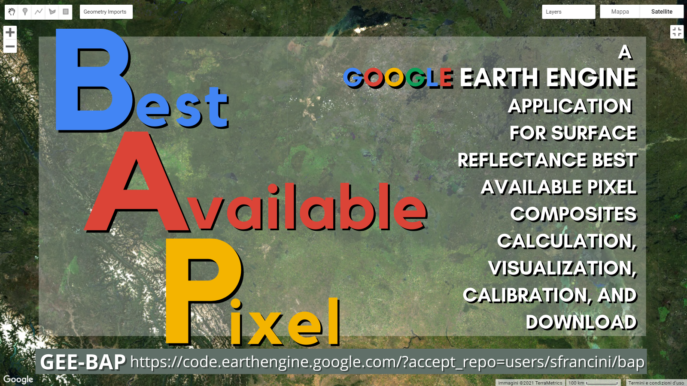

# BAP-GEE 

**A Google Earth Engine application for Best Available Pixel composites calculation, visualization, calibration, and download**

  

## [BAP-GEE application](https://code.earthengine.google.com/24a3dcb67084449a34b5ffe271c418d2?hideCode=true) 

## [BAP-GEE codes](https://code.earthengine.google.com/?accept_repo=users/sfrancini/bap) 

   

## Introduction
In this guide we summarize how to use the Best Available Pixel (BAP) image compositing application in Google Earth Engine (GEE): GEE-BAP. This GEE application enables the generation of annual BAP image composites for large areas combining multiple Landsat sensors and images. Herein we describe the pixel scoring functions and tuning parameters, as well as data output options.
Annual BAP image composites are generated by choosing optimal observations for each pixel from all available Landsat-5 TM, Landsat-7 ETM+, and Landsat-8 OLI imagery depending on year within a date range and constrains defined by the user. The data accessible via GEE is from the United States Geological Survey (USGS) free and open archive of [Landsat data](https://earthexplorer.usgs.gov/). The Landsat images used are atmospherically corrected to [surface reflectance values](https://www.usgs.gov/core-science-systems/nli/landsat/landsat-surface-reflectance?qt-science_support_page_related_con=0#qt-science_support_page_related_con). Following White et al. (2014), the scoring functions rank each pixel observation for (i) acquisition day of year, (ii) cloud cover in the scene, (iii) distance to clouds and cloud shadows, and (iv) sensor. Further information on the BAP image compositing approach can be found in [Griffiths et al. (2013)](https://ieeexplore.ieee.org/document/6415303), and detailed information on tuning parameters can be found in [White et al. (2014)](https://www.tandfonline.com/doi/full/10.1080/07038992.2014.945827)

## Citation of BAP process background:
White, J.C.; Wulder, M.A.; Hobart, G.W.; Luther, J.E.; Hermosilla, T.; Griffiths, P.; Coops, N.C.; Hall, R.J.; Hostert, P.; Dyk, A.; et al. Pixel-based image compositing for large-area dense time series applications and science. Can. J. Remote Sens. 2014, 40, 192–212, [doi:10.1080/07038992.2014.945827](https://doi.org/10.1080/07038992.2014.945827).

## Input/Output options

### *Study area definition*
There are three options to define the study area.
a.	Draw study area. This option uses the tools “Draw a shape” and “Draw a rectangle” to define the area of interest.
b.	Upload image template. The area of interest and projection can be defined by uploading an image template. The image template must be in tiff format. See [GEE official guide](https://developers.google.com/earth-engine/guides/image_upload#uploading-image-assets) for further information on image uploading. 
c.	Work globally. This option generates BAP image composites for the whole world. Note that using this option download is not available.

### *Start year/End year*
Indicate the beginning and end of the annual time series of BAP image composites to be generated. Image composites are uniquely made for each year utilizing images acquired in the days indicated in the Date range. Multiple composites are therefore created serving to generate a time series. 

### *Download Images*
Clicking this box enables to save the results in your personal Google Drive using the [tasks tab](https://developers.google.com/earth-engine/guides/playground#tasks-tab). The default folder name is “bapOutputs” but a different name can be typed if needed.
Results are generated in tiled, tiff images. Together with the image composites user can download an “inputParameters” csv file that indicates the parameters used to construct the composite.

## Pixel scoring functions
### *Acquisition day of year and Day range*
Candidate pixels acquired closer to a defined acquisition day of year are ranked higher. Only pixels acquired within the day range window are considered. Thus, if target day is defined as 08-01 and day range as 31, those pixels acquired between July 1st and August 31st are considered, and the ones acquired closer to August 1st will receive a higher score.

### *Max cloud cover in scene*
This scoring function defines the maximum percentage of a scene covered by clouds to be accepted in the BAP image compositing process. Defining a value of 70% implies that only those scenes with a cloud cover less than 70% will be used.

*Distance to clouds and cloud shadows*
Pixels identified to contain clouds and shadows by the QA mask are not considered in the BAP image compositing process. This scoring function decreases the score of a pixel if this is in the proximity of a cloud or cloud shadow. Units are meters.

### *Atmospheric opacity*
This scoring function ranks pixels based on their atmospheric opacity values, which are indicative of hazy imagery. Max opacity: Pixels with opacity values that exceed a defined haze expectation are excluded [0.3 by default]. Min opacity: Pixels with opacity values lower than a defined value [0.2 by default] get the maximum score. Pixels with values in between these limits are scored following the functions defined by Griffiths et al., 2013).

### *Landsat-7 ETM+ SLC-off penalty*
This scoring function penalizes images acquired following the ETM+ Scan Line Corrector malfunction (SLC-off). The larger the value the larger the penalty. This scoring element can be used to ensure that TM or OLI data takes precedence over ETM+ post SLC-off. In so doing, users can avoid the inclusion of multiple discontinuous small portions of images being used to produce the BAP image composites, thus reducing the spatial variability of the spectral data. The penalty applied to SLC off image is defined directly proportional to the score. A large penalty reduces the chance that SLC-off imagery will be used in the composite. A value of 1 prevents SLC-off imagery from being used.

## Advanced parameters
### *Apply de-spiking algorithm*
This option enables users to further reduce the presence of unscreened atmospheric anomalies using the de-spiking algorithm introduced in Kennedy et al. (2010). If a spike is larger than the defined threshold times the difference, the pixel is flagged as noise. This detection of anomalous values is applied independently to each of the six Landsat bands. The user can indicate the number of spectral bands that need to be flagged by the de-spiking algorithm to consider that pixel as noisy and to in turn be labelled as no data.

### *Infill data gaps*
This option enables the generation of gap-free image composites by applying linear interpolation to the temporal spectral values. 

### *Spectral index*
By default, the BAP application produces image composites using all the visible bands. This option calculates the selected spectral index using the BAP image composites. Available indices are: NDVI, EVI, NBR, and tasseled cap wetness (TCW), greenness (TCG), brightness (TCB) and angle (TCA). If a spectral index is selected, the user can adjust the minimum and maximum values for stretching the visualization of the results. Indices are also available for downloading.

## Execution
### *Run BAP*
Executes the BAP image composite with the selected parameters over the defined study area.

### *Reset composites*
Removes the previously generated BAP image composites form the layers tab.

### *Progress*
Determination of execution completeness can be monitored by looking at the Layers panel in the GEE interface. White indicates complete, grey is proportion remaining to be completed. 

## Tips and tricks
- Use the top sliding bar to navigate through the different annual BAP image composites.
- Larger data ranges will increase the availability of candidate pixels, but these might represent different phenological conditions.
- Use “Apply de-spiking algorithm” to further filter unscreened clouds and atmospheric anomalies.
- Use “Infill data gaps” to generate gap-free wall-to-wall BAP image composites. 
- Please, be patient after pressing “Run BAP”. The calculation will start over again if you change the visualization window.
- Generate several BAP image composites testing different parameters and compare the outputs. Then, download your preferred BAP image composite once you find it.
- To automatically execute the BAP image compositing procedure consider using the functions available in the library instead of the user interface. Main callable functions we provide are: BAP(), despikeCollection(), infill(), ShowCollection(), DownloadCollection() and DownloadCollectionAsImage(). This will enable running the application in batch mode varying the tuning parameters, and also integrating the BAP image compositing procedure in other applications.
